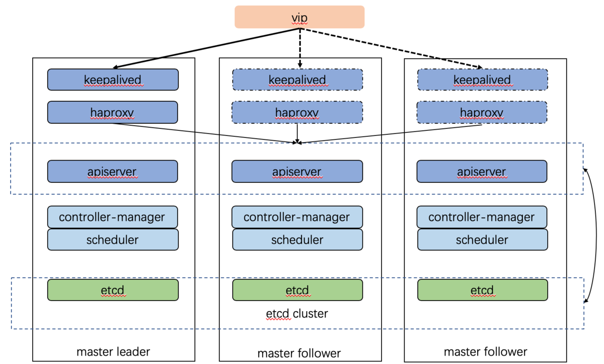

# Centos8安装k8s1.22.2+keepalived+haproxy高可用集群

## 最新的经过验证的 Docker 版本依赖关系

[最新的经过验证的 Docker 版本依赖关系](https://github.com/kubernetes/kubernetes/blob/master/build/dependencies.yaml)

## 部署架构

堆叠（Stacked） etcd 拓扑图


部署架构图



## 主机规划

IP|主机名或用途
-----|-----
172.16.92.250|VIP
172.16.188.11|bfs-k8s-master1.solarfs.k8s
172.16.94.181|bfs-k8s-master2.solarfs.k8s
172.16.241.26|bfs-k8s-master3.solarfs.k8s
172.16.13.77|bfs-k8s-node1.solarfs.k8s
172.16.36.25|bfs-k8s-node2.solarfs.k8s
172.16.115.194|bfs-k8s-node3.solarfs.k8s

信息|备注
-----|-----
系统版本|CentoOS 8.3
Docker 版本|20.10
K8s 版本|1.22.2
Pod 网段|10.128.0.0/16
Service 网段|10.96.0.0/12

## 主机初始化

参考：[Centos7安装k8s1.21.0使用阿里云负载均衡部署高可用集群.md](./Centos7安装k8s1.21.0使用阿里云负载均衡部署高可用集群.md)

### 所有主机设置主机名
### 所有主机禁用 firewalld
### 所有主机安装容器运行时

#### 所有主机安装 Docker

参考：[Centos7安装k8s1.21.0使用阿里云负载均衡部署高可用集群.md](./Centos7安装k8s1.21.0使用阿里云负载均衡部署高可用集群.md)

因为 Centos8 默认安装了 podman 与 docker 安装冲突，所以安装 docker 运行时需要先卸载 podman 相关

卸载 podman runc

```
yum remove podman runc
yum autoremove
```

剩下的安装步骤同 Centos7

### 所有节点安装 kubeadm、kubelet 和 kubectl

参考：[Centos7安装k8s1.21.0使用阿里云负载均衡部署高可用集群.md](./Centos7安装k8s1.21.0使用阿里云负载均衡部署高可用集群.md)

注意：centos8 安装kubeadm、kubelet 和 kubectl，还需要多安装一个 tc 命令，其它 master 主机 在使用 kubeadm 在添加控制平面服务时，如果 没有 安装 tc 命令会失败

#### 所有 master 主机安装 tc

```
yum insatll -y tc
```

### 所有节点安装

### ipvs 内核配置

其它步骤参考：[Centos7安装k8s1.21.0使用阿里云负载均衡部署高可用集群.md](./Centos7安装k8s1.21.0使用阿里云负载均衡部署高可用集群.md)

ipvs 在 Centos8 不同的地方只有以 加载 ipvs相关,Centos8 没有nf_conntrack_ipv4 模块，所以加载的是 nf_conntrack

#### 加载 ipvs 相关内核配置

```
# load module <module_name>
modprobe -- ip_vs
modprobe -- ip_vs_rr
modprobe -- ip_vs_wrr
modprobe -- ip_vs_sh
modprobe -- nf_conntrack

# to check loaded modules, use
lsmod | grep -e ip_vs -e nf_conntrack
# or
cut -f1 -d " "  /proc/modules | grep -e ip_vs -e nf_conntrack
```

最后输出检查结果如下

```
ip_vs_sh
ip_vs_wrr
ip_vs_rr
ip_vs
nf_conntrack_netlink
nf_conntrack
```

## 搭建负载均衡服务

参考：[软件负载平衡选项指南](https://github.com/kubernetes/kubeadm/blob/master/docs/ha-considerations.md)

### 使用 keepalived+haproxy

#### 配置 keepalived

##### 所有 master 主机 创建 /etc/keepalived/keepalived.conf

```
! /etc/keepalived/keepalived.conf
! Configuration File for keepalived
global_defs {
    router_id LVS_DEVEL
}
vrrp_script check_apiserver {
  script "/etc/keepalived/check_apiserver.sh"
  interval 3
  weight -2
  fall 10
  rise 2
}

vrrp_instance master-vip {
    state BACKUP # master1 为 MASTER, 其它 master 为 BACKUP
    interface eth0
    virtual_router_id 250
    priority 100
    authentication {
        auth_type PASS
        auth_pass solarfs250
    }
    unicast_src_ip 172.16.188.11     # The IP address of this machine
    unicast_peer { # The IP address of peer machines
         172.16.94.181
         172.16.241.26
    }

    virtual_ipaddress {
        172.16.92.250 # master vip
    }
    track_script {
        check_apiserver
    }
}
```

##### 所有 master 主机创建 `/etc/keepalived/check_apiserver.sh`

```
#!/bin/sh

errorExit() {
    echo "*** $*" 1>&2
    exit 1
}}

curl --silent --max-time 2 --insecure https://localhost:8443/ -o /dev/null || errorExit "Error GET https://localhost:8443/"
if ip addr | grep -q 172.16.92.250; then
    curl --silent --max-time 2 --insecure https://172.16.92.250:8443/ -o /dev/null || errorExit "Error GET https://172.16.92.250:8443/"
fi
```

##### master1 主机创建 keepalived 静态 pod

kubelet 正常启动后会自动加载 `/etc/kubernetes/manifests` 中静态pod 服务，所有创建 `/etc/kubernetes/manifests/keepalived.yaml`， keepalived 会同 etcd、kube-apiserver、kube-scheduler、kube-controller-manager 等服务 在 k8s 集群启动前启动

注意：其它 master 主机在添加到集群前不能创建静态 pod, 否则在添加到集群时会因为存在`/etc/kubernetes/manifests` 目录而失败

master1 主机创建 keepalived 静态 pod 文件 `/etc/kubernetes/manifests/keepalived.yaml`

```
apiVersion: v1
kind: Pod
metadata:
  creationTimestamp: null
  name: keepalived
  namespace: kube-system
spec:
  containers:
  - image: osixia/keepalived:2.0.17
    name: keepalived
    resources: {}
    securityContext:
      capabilities:
        add:
        - NET_ADMIN
        - NET_BROADCAST
        - NET_RAW
    volumeMounts:
    - mountPath: /usr/local/etc/keepalived/keepalived.conf
      name: config
    - mountPath: /etc/keepalived/check_apiserver.sh
      name: check
  hostNetwork: true
  volumes:
  - hostPath:
      path: /etc/keepalived/keepalived.conf
    name: config
  - hostPath:
      path: /etc/keepalived/check_apiserver.sh
    name: check
status: {}
```

#### 配置 haproxy

##### 所有 master 主机创建配置 `/etc/haproxy/haproxy.cfg`

```
# /etc/haproxy/haproxy.cfg
#---------------------------------------------------------------------
# Global settings
#---------------------------------------------------------------------
global
    log /dev/log local0
    log /dev/log local1 notice
    daemon

#---------------------------------------------------------------------
# common defaults that all the 'listen' and 'backend' sections will
# use if not designated in their block
#---------------------------------------------------------------------
defaults
    mode                    http
    log                     global
    option                  httplog
    option                  dontlognull
    option http-server-close
    option forwardfor       except 127.0.0.0/8
    option                  redispatch
    retries                 1
    timeout http-request    10s
    timeout queue           20s
    timeout connect         5s
    timeout client          20s
    timeout server          20s
    timeout http-keep-alive 10s
    timeout check           10s

#---------------------------------------------------------------------
# apiserver frontend which proxys to the control plane nodes
#---------------------------------------------------------------------
frontend apiserver
    bind *:8443
    mode tcp
    option tcplog
    default_backend apiserver

#---------------------------------------------------------------------
# round robin balancing for apiserver
#---------------------------------------------------------------------
backend apiserver
    option httpchk GET /healthz
    http-check expect status 200
    mode tcp
    option ssl-hello-chk
    balance     roundrobin
        server master1.solarfs.k8s 172.16.188.11:6443 check
        server master2.solarfs.k8s 172.16.94.181:6443 check
        server master3.solarfs.k8s 172.16.241.26:6443 check
```

##### master1 主机创建 haproxy 静态 pod

kubelet 正常启动后会自动加载 `/etc/kubernetes/manifests` 中静态pod 服务，所有创建 `/etc/kubernetes/manifests/haproxy.yaml`， haproxy 会同 etcd、kube-apiserver、kube-scheduler、kube-controller-manager 等服务 在 k8s 集群启动前启动

注意：其它 master 主机在添加到集群前不能创建静态 pod, 否则在添加到集群时会因为存在`/etc/kubernetes/manifests` 目录而失败

master1 主机创建 haproxy 静态 pod 文件 `/etc/kubernetes/manifests/haproxy.yaml`

```
apiVersion: v1
kind: Pod
metadata:
  name: haproxy
  namespace: kube-system
spec:
  containers:
  - image: registry.hisun.netwarps.com/library/haproxy:2.1.4
    name: haproxy
    livenessProbe:
      failureThreshold: 8
      httpGet:
        host: localhost
        path: /healthz
        port: 8443
        scheme: HTTPS
    volumeMounts:
    - mountPath: /usr/local/etc/haproxy/haproxy.cfg
      name: haproxyconf
      readOnly: true
  hostNetwork: true
  volumes:
  - hostPath:
      path: /etc/haproxy/haproxy.cfg
      type: FileOrCreate
    name: haproxyconf
```

### 操作系统初始化
参考：[Centos7安装k8s1.21.0使用阿里云负载均衡部署高可用集群.md](./Centos7安装k8s1.21.0使用阿里云负载均衡部署高可用集群.md)

### 重启主机 

## 配置 dns

### 所有 node 设置主机名解析及 api-server解析

例如 node1,依次设置所有 node

```
172.16.92.250	api-server.kont.k8s
172.16.13.77	bfs-k8s-node1.solarfs.k8s
```

### 所有主机安装配置 dnsmasq

参考：[Centos7安装k8s1.21.0使用阿里云负载均衡部署高可用集群.md](./Centos7安装k8s1.21.0使用阿里云负载均衡部署高可用集群.md)

## 使用 kubeadm 创建高可用集群

参考：[Centos7安装k8s1.21.0使用阿里云负载均衡部署高可用集群.md](./Centos7安装k8s1.21.0使用阿里云负载均衡部署高可用集群.md)

## 其它 master 主机同步 keepalived/haproxy 静态 pod

其它 master 正常添加到集群后，就可以在其它 master 主机同步`keepalived/haproxy`静态 pod 配置文件了

在另外两个 master 同步以下文件

```
/etc/kubernetes/manifests/keepalived.yaml
/etc/kubernetes/manifests/haproxy.yaml
```

查看 keepalived haproxy 的 pod 状态

```
kubectl get pod -n kube-system
```

最终显示如下

```
...
haproxy-master1.solarfs.k8s                   1/1     Running   7 (54m ago)    105m
haproxy-master2.solarfs.k8s                   1/1     Running   2 (55m ago)    102m
haproxy-master3.solarfs.k8s                   1/1     Running   3 (53m ago)    102m
keepalived-master1.solarfs.k8s                1/1     Running   7 (54m ago)    105m
keepalived-master2.solarfs.k8s                1/1     Running   1 (86m ago)    102m
keepalived-master3.solarfs.k8s                1/1     Running   2 (53m ago)    102m
...
```

## 其它步骤

参考：[Centos7安装k8s1.21.0使用阿里云负载均衡部署高可用集群.md](./Centos7安装k8s1.21.0使用阿里云负载均衡部署高可用集群.md)


## 参考

[Centos7安装k8s1.21.0使用阿里云负载均衡部署高可用集群.md](./Centos7安装k8s1.21.0使用阿里云负载均衡部署高可用集群.md)

https://www.kubernetes.org.cn/6964.html

https://kubernetes.io/zh/docs/setup/production-environment/tools/kubeadm/ha-topology/