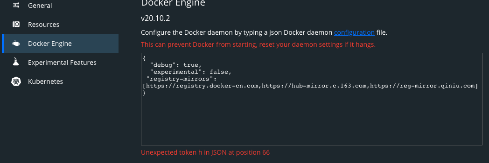
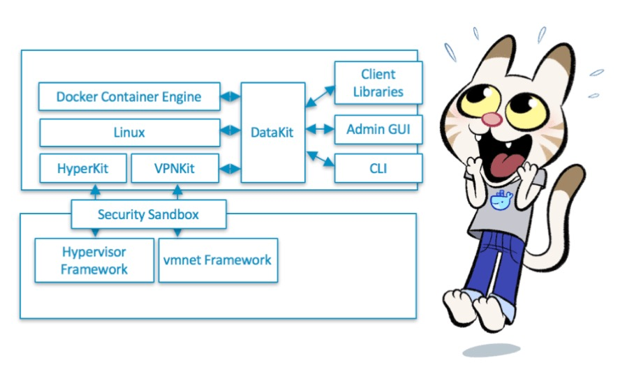

# MacOS 本地基于 Docker Desktop 搭建 K8S 环境
## 1 部署 Docker Desktop
- [下载 Docker CE最新版本](https://hub.docker.com/search?type=edition&offering=community)
- 按照提示部署

## 2 部署部署 docker k8s
### 2.1 启动 Docker 查看对应的 K8S 版本
- 点击 `about Docker Desktop`,文档当前版本为 k8s `v1.19.3`

	

### 2.2 拉取 k8s 依赖的镜像
因为众所周知的原因，所以需要通过国内镜像仓库下载，这里可以按照网站[操作](https://github.com/AliyunContainerService/k8s-for-Docker-Desktop)

```
git clone https://github.com/AliyunContainerService/k8s-for-docker-desktop.git
```
切换分支到之前对应的 k8s 分之,当前版本是：`v1.19.3`

```
cd k8s-for-docker-desktop
git checkout -b v1.19.3 origin/v1.19.3


# cat images.properties
# 这里存放的是k8s依赖的镜像
```

**执行脚本，通过国内仓库拉取依赖的镜像，注意这里的镜像和 docker 默认设置的 dockerhub 的镜像仓库不是一个**

```
cd k8s-for-docker-desktop
./load_images.sh
```
### 2.3 开启配置，启动k8s
勾选如下：


然后重启，Docker。

### 2.4 遇到问题：
Docker 启动了，但是k8s一直卡在starting，检查方法

- docker ps 

	查看 k8s 集群是否已经启动
- docker images

	查看镜像是否存在，如果不存在，执行上面的预加载镜像脚本
- 如果镜像存在但是容器没启动，查看日志

		cannot get lease for master node: an error on the server ("") has prevented the request from succeeding (get leases.coordination.k8s.io docker-desktop)

	这个是因为某种原因死锁
	
	解决办法
	
		Deleting the PKI folder (~/Library/Group Containers/group.com.docker/pki) and restarting Docker works around the issue.
	
- 重启 docker 
	

## 3 测试 docker k8s 集群
### 3.1 集群检查
- 通过 ui 设置 kubectl 使用的集群或者使用命令行

		kubectl config use-context docker-desktop
- 验证 Kubernetes 集群状态

		kubectl cluster-info
		kubectl get nodes

### 3.2 k8s 控制台 部署
- 配置 docker 加速
	
	进入 docker 控制台，增加如下语句，并重启 docker
	
		"registry-mirrors": [https://hub-mirror.c.163.com/,https://reg-mirror.qiniu.com,https://registry.docker-cn.com]
	
- 预加载镜像

		docker pull kubernetesui/dashboard:v2.0.4
		docker pull kubernetesui/metrics-scraper:v1.0.4
- 发布 k8s 控制台

	进入 k8s-for-docker-desktop 目录
	
		kubectl create -f kubernetes-dashboard.yaml
-  检查 kubernetes-dashboard 应用状态

```
kubectl get pod -n kubernetes-dashboard

```

- 创建控制台登陆 token

		TOKEN=$(kubectl -n kube-system describe secret default| awk '$1=="token:"{print $2}')
		kubectl config set-credentials docker-for-desktop --token="${TOKEN}"
		echo $TOKEN		
- 开启控制台访问代理

```
kubectl proxy --port=8080 

```

- 通过如下 URL 访问 Kubernetes dashboard

```
http://127.0.0.1:8080/api/v1/namespaces/kubernetes-dashboard/services/https:kubernetes-dashboard:/proxy/#/overview?namespace=_all
```

- 选择使用方式
	- 令牌登陆，填入上面的 TOKEN
	- 或者使用配置文件，mac 在 `$HOME/.kube/config`

## 3 部署 helm
通过 brew 部署

	# Use homebrew on Mac
	brew install helm
	
	# Add helm repo
	helm repo add stable http://mirror.azure.cn/kubernetes/charts/
	
	# Update charts repo
	helm repo update

## 4 Docker 基础知识 
### 4.1 Docker for Mac 基本原理
Docker 是利用 Linux 的 Namespace 和 Cgroups 来实现资源的隔离和限制，容器共享宿主机内核，所以 Mac 本身没法运行 Docker 容器的，它是通过本地跑了一个虚拟机来运行 Docker，利用 Hypervisor 采用 [xhyve](https://github.com/moby/hyperkit) (基于 Mac 自带的虚拟化方案 Hypervisor.framework)，虚拟机里运行的发行版是 Docker 自己打包的 LinuxKit。



	虚拟机部署目录 `～/Library/Containers/com.docker.docker/Data/vms/0`
	
	% ls -l ~/Library/Containers/com.docker.docker/Data/vms/0
	total 21641512
	srwxr-xr-x  1 Prometheus  staff            0  1 19 12:34 00000002.000005f4
	srwxr-xr-x  1 Prometheus  staff            0  6 15  2020 00000002.00001000
	srwxr-xr-x  1 Prometheus  staff            0  6 15  2020 00000002.00001001
	srwxr-xr-x  1 Prometheus  staff            0  1 19 12:34 00000002.00001003
	srwxr-xr-x  1 Prometheus  staff            0  6 15  2020 00000002.0000f3a5
	srwxr-xr-x  1 Prometheus  staff            0  1 19 12:34 00000003.000005f5
	srwxr-xr-x  1 Prometheus  staff            0  1 19 12:34 00000003.00000948
	-rw-r--r--@ 1 Prometheus  staff  63999836160  1 19 18:40 Docker.raw <- 这个就是虚拟机文件
	-rw-r--r--  1 Prometheus  staff       100352  6 15  2020 config.iso <- 虚拟机 iso
	srwxr-xr-x  1 Prometheus  staff            0  1 19 12:34 connect
	-rw-r--r--  1 Prometheus  staff        65536  1 19 12:34 console-ring
	drwxr-xr-x  2 Prometheus  staff           64 12 23 11:04 data
	lrwxr-xr-x  1 Prometheus  staff           17  1 19 12:34 guest.000005f5 -> 00000003.000005f5
	lrwxr-xr-x  1 Prometheus  staff           17  1 19 12:34 guest.00000948 -> 00000003.00000948
	-rw-r--r--  1 Prometheus  staff         2379  1 19 12:34 hyperkit.json
	-rw-r--r--  1 Prometheus  staff            5  1 19 12:34 hyperkit.pid
	drwxr-xr-x  2 Prometheus  staff           64  3 15  2019 log
	-rw-r--r--  1 Prometheus  staff           36  3 15  2019 nic1.uuid
	lrwxr-xr-x  1 Prometheus  staff           12  6 15  2020 tty -> /dev/ttys000 <- 终端文件
### 4.2 虚拟机终端
- 模拟终端

	一般情况使用 `screen` 命令进入终端，空白页后回车，然后跳出登陆输入用户密码如
	
		screen ~/Library/Containers/com.docker.docker/Data/vms/0/tty
		回车
		User: root
		Password:
	但是现在有 bug [docker issue](https://github.com/docker/for-mac/issues/4822) 
- 使用特权 docker 登陆

	还有一种相对更优雅的方式，使用特权容器来看，注意因为 mac 虚拟机问题，所以默认特权就是 host 网络(vm网络),这个也适用于 Windows 的 Docker Moby Linux VM（不适用于Windows容器）
	
		docker run -it --rm --privileged --pid=host --name docker-vm justincormack/nsenter1
	- 查看虚拟机目录		
		
			# ls -l /var/lib/docker
			total 100
			drwx------    2 root     root          4096 Mar 15  2019 builder
			drwx------    4 root     root          4096 Dec 23 03:05 buildkit
			drwx------    3 root     root          4096 Mar 15  2019 containerd
			drwx------   40 root     root         12288 Jan 19 08:20 containers
			drwx------    3 root     root          4096 Mar 15  2019 image
			drwxr-x---    3 root     root          4096 Mar 15  2019 network
			drwx------  229 root     root         40960 Jan 19 08:20 overlay2
			drwx------    4 root     root          4096 Mar 15  2019 plugins
			drwx------    2 root     root          4096 Jan 19 04:35 runtimes
			drwx------    2 root     root          4096 Mar 15  2019 swarm
			drwx------    2 root     root          4096 Jan 19 08:05 tmp
			drwx------    2 root     root          4096 Mar 15  2019 trust
			drwx------    2 root     root          4096 Jan 19 04:35 volumes
	- 查看主机网络
	
			/ # ip a
			1: lo: <LOOPBACK,UP,LOWER_UP> mtu 65536 qdisc noqueue state UNKNOWN group default qlen 1000
			    link/loopback 00:00:00:00:00:00 brd 00:00:00:00:00:00
			    inet 127.0.0.1/8 brd 127.255.255.255 scope host lo
			       valid_lft forever preferred_lft forever
			    inet6 ::1/128 scope host
			       valid_lft forever preferred_lft forever
			2: eth0: <BROADCAST,MULTICAST,UP,LOWER_UP> mtu 1500 qdisc pfifo_fast state UP group default qlen 1000
			    link/ether 02:50:00:00:00:01 brd ff:ff:ff:ff:ff:ff
			    inet 192.168.65.3/24 brd 192.168.65.255 scope global eth0 <- 同 k8s node
			       valid_lft forever preferred_lft forever
			    inet6 fe80::50:ff:fe00:1/64 scope link
			       valid_lft forever preferred_lft forever			....

### 4.3 打通 docker 和主机网络
#### 4.3.1 说明
Docker for Mac无法在macOS通过IP直接访问Docker中容器，只能通过EXPOSE端口来访问,打通 docker 虚拟机和主机(MacOS)之间的网络可以有很多种，但是构建 VPN 应该是最简单的一种。参考 [mac-docker-connector](https://github.com/wenjunxiao/mac-docker-connector)

- 网络双工模型

		+------------+          +-----------------+
		|            |          |    Hypervisor   |
		|   macOS    |          |  +-----------+  |
		|            |          |  | Container |  |
		|            |   vpn    |  +-----------+  |
		| VPN Client |<-------->|   VPN Server    |
		+------------+          +-----------------+
	
	
		+------------+          +-----------------+
		|            |          |    Hypervisor   |
		|   macOS    |          |  +-----------+  |
		|            |          |  | Container |  |
		|            |   vpn    |  +-----------+  |
		| VPN Server |<-------->|   VPN Client    |
		+------------+          +-----------------+
- 网络通讯模型

		+------------+          +-----------------+
		|            |          |    Hypervisor   |
		|   macOS    |          |  +-----------+  |
		|            |          |  | Container |  |
		|            |   udp    |  +-----------+  |
		| TUN Server |<-------->|   TUN Client    |
		+------------+          +-----------------+	
#### 4.3.2 部署
- 容器端
	- 下载镜像，注意这里用了 mirror 后可能会提示 `Error response from daemon: pull access denied for mac-docker-connector`，无视，再执行一遍可能就好了。我理解是刷缓存
			
			docker pull wenjunxiao/mac-docker-connector
	- 启动
		
			docker run -it -d --restart always --net host --cap-add NET_ADMIN --name mac-docker-connector wenjunxiao/mac-docker-connector
			779bcac7caa106966e1fe88fe1e4ccf56aa4023c29db1ec2258b6c6115857b83
			docker ps -a
			CONTAINER ID   IMAGE                             COMMAND                  CREATED         STATUS         PORTS     NAMES
			779bcac7caa1   wenjunxiao/mac-docker-connector   "mac-receiver"           7 seconds ago   Up 7 seconds             mac-docker-connector
		- 启动参数 `--cap-add NET_ADMIN` 说明

			默认情况下，在容器中进行网络管理相关操作会失败,比如
			
				ip link set eth0 down
				RTNETLINK answers: Operation not permitted
			但是增加了 `-cap-add=NET_ADMIN` 就正常了	
			用于管理容器的权限：

			- -cap-add: 添加 Linux 功能
			- -cap-drop: 删除 Linux 功能	
			- -privileged=false: 给予容器扩展特权
			- -device=[]: 在没有特权模式下运行一个设备
- mac 端
	- 部署

			$ brew tap wenjunxiao/brew
			$ brew install docker-connector
	- 安装位置
	
			/usr/local/Cellar/docker-connector/2.0/bin
	- 配置文件 ` /usr/local/etc/docker-connector.conf`
		
		配置文件修改无需启动立即生效，说明
		
		-  `route subnet`
			- 进入 docker 虚拟机

					docker run -it --rm --privileged --pid=host --name docker-vm justincormack/nsenter1  
				- 查看 docker 内部 kubenetes service 网段
						
						cat /etc/kubernetes/manifests/kube-apiserver.yaml | grep service-cluster-ip-range |awk -F '=' '{print $2}'
						10.96.0.0/12
				- 查看 docker 虚拟机网络
	
						# ip addr show eth0
						2: eth0: <BROADCAST,MULTICAST,UP,LOWER_UP> mtu 1500 qdisc pfifo_fast state UP group default qlen 1000
						    link/ether 02:50:00:00:00:01 brd ff:ff:ff:ff:ff:ff
						    inet 192.168.65.3/24 brd 192.168.65.255 scope global eth0
						       valid_lft forever preferred_lft forever
						    inet6 fe80::50:ff:fe00:1/64 scope link
						       valid_lft forever preferred_lft forever
				- 退出虚拟机		       
			-  查看容器网桥地址段
	
					docker network ls --filter driver=bridge --format "{{.ID}}" | xargs docker network inspect --format "route {{range .IPAM.Config}}{{.Subnet}}{{end}}" 
			- 将以上 ip 加入到配置文件

					echo 'route 10.96.0.0/12' >> /usr/local/etc/docker-connector.conf
					echo 'route 1192.168.65.3/24' >> /usr/local/etc/docker-connector.conf
		- 高级(未测试)
			- 暴露给其他同网络的人
				
					#监听端口添加
					expose 0.0.0.0:2512
					# 共享网段
					route 172.17.0.0/16 expose
					# 共享安全 token 和 ip，格式为 token $token信息 $联入IP
					token user1 192.168.251.10
					token user2 192.168.251.11
				- mac 联机
	
						brew install wenjunxiao/brew/docker-accessor
						sudo docker-accessor -remote 192.168.1.100:2512 -token user1
				- win 联机
	
					从 OpenVPN 下载并安装 [tap 驱动:tap-windows](http://build.openvpn.net/downloads/releases/latest/tap-windows-latest-stable.exe)
	
					从 mac-docker-connector/releases 下载最新适合当前操作系统的 `docker-accessor-win-i686.zip` 或 `docker-accessor-win-x86_64.zip` 解压即可
	
						D:\Downloads\>.\docker-accessor.exe -remote 192.168.1.100:2512 -token user2
	以管理员权限打开控制台
				- linux 联机
	
					直接从 mac-docker-connector 下载最新的 `docker-accessor-linux.tar.gz` 解压即可
					
						curl -L -o- https://github.com/wenjunxiao/mac-docker-connector/releases/download/v2.0/docker-accessor-linux.tar.gz | tar -xzf - -C /usr/local/bin
						sudo docker-accessor -remote 192.168.1.100:2512 -token user1
				- 联入 docker 网络和主机网络冲突通过添加 `-exclube` 来避免
	
						docker-accessor -remote 192.168.1.100:2512 -token my-token -exclude 172.1.0.0/24,172.2.0.0/24
	- 启动
		- 前台启动

				sudo docker-connector -config /usr/local/etc/docker-connector.conf
		- 后台启动

				sudo brew services start wenjunxiao/brew/docker-connector
				# or 
				sudo brew services start docker-connector
	- 服务检查
		- 查看服务状态

				sudo brew services
				Name             Status  User       Plist
				docker-connector started root       /Library/LaunchDaemons/homebrew.mxcl.docker-connector.plist
		- 查看路由情况

				netstat -nr -f inet | grep utun2
				10.96/12           192.168.251.1      UGSc         utun2
				192.168.65         192.168.251.1      UGSc         utun2
				192.168.251.1      192.168.251.2      UH           utun2
		- 用 ping 检查

				ping 192.168.65.3
				PING 192.168.65.3 (192.168.65.3): 56 data bytes
				64 bytes from 192.168.65.3: icmp_seq=0 ttl=64 time=2.965 ms
		- 打开网页直接使用 service ip 访问服务

					
## 文档参考
- [Deploy on Kubernetes](https://docs.docker.com/docker-for-mac/kubernetes/)
- [Docker Desktop for Mac/Windows 开启 Kubernetes](https://github.com/AliyunContainerService/k8s-for-docker-desktop)
- [如何访问由Docker的HyperKit创建的VM？](https://qastack.cn/programming/39739560/how-to-access-the-vm-created-by-dockers-hyperkit)
- [nsenter1 for github](https://github.com/justincormack/nsenter1)
- [BretFisher/docker-for-mac.md](https://gist.github.com/BretFisher/5e1a0c7bcca4c735e716abf62afad389)
- [mac-docker-connector](https://github.com/wenjunxiao/mac-docker-connector)
- [[Docker]Mac访问Docker容器IP](https://blog.csdn.net/wenjun_xiao/article/details/106320242)
- [Networking features in Docker Desktop for Mac](https://docs.docker.com/docker-for-mac/networking/#i-cannot-ping-my-containers)
- [Docker解析：配置与权限管理](https://hustcat.github.io/docker-config-capabilities/)