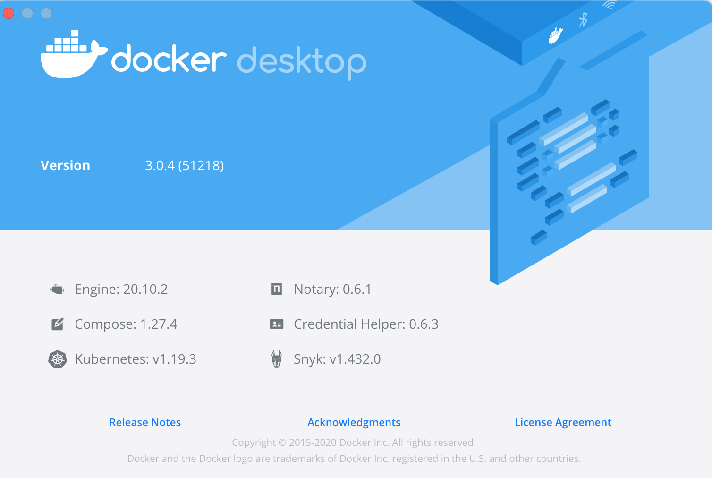
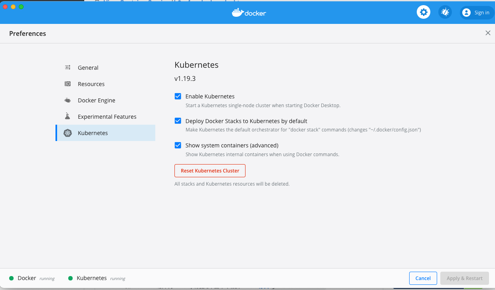

# MacOS 本地基于 Docker Desktop 搭建 K8S 环境

## 1、安装 Docker Desktop
- [下载 Docker CE最新版本](https://hub.docker.com/search?type=edition&offering=community)
- 按照提示安装

## 2、启动 Docker 查看对应的 K8S 版本
- 点击 `about Docker Desktop`,文档当前版本为 k8s `v1.19.3`

	

## 3、拉取 k8s 依赖的镜像
因为众所周知的原因，所以需要通过国内镜像仓库下载，这里可以按照网站[操作](https://github.com/AliyunContainerService/k8s-for-Docker-Desktop)

```
git clone https://github.com/AliyunContainerService/k8s-for-docker-desktop.git
```
切换分支到之前对应的 k8s 分之,当前版本是：`v1.19.3`

```
cd k8s-for-docker-desktop
git checkout -b v1.19.3 origin/v1.19.3


# cat images.properties
# 这里存放的是k8s依赖的镜像
```

**执行脚本，通过国内仓库拉取依赖的镜像，注意这里的镜像和 docker 默认设置的 dockerhub 的镜像仓库不是一个**

```
cd k8s-for-docker-desktop
./load_images.sh
```

## 4、开启配置，启动k8s
勾选如下：



然后重启，Docker。


## 5、遇到问题：
Docker 启动了，但是k8s一直卡在starting，检查方法

- docker ps 

	查看 k8s 集群是否已经启动
- docker images

	查看镜像是否存在，如果不存在，执行上面的预加载镜像脚本
- 如果镜像存在但是容器没启动，查看日志

		cannot get lease for master node: an error on the server ("") has prevented the request from succeeding (get leases.coordination.k8s.io docker-desktop)

	这个是因为某种原因死锁
	
	解决办法
	
		Deleting the PKI folder (~/Library/Group Containers/group.com.docker/pki) and restarting Docker works around the issue.
	
- 重启 docker 
	
## 6、集群检查

```
# 通过ui 设置 kubectl 使用的集群或者使用命令行
kubectl config use-context docker-desktop

## 验证 Kubernetes 集群状态
kubectl cluster-info
kubectl get noDes
```

## 7、使用
### 7.1 配置k8s控制台


```
$ kubectl apply -f https://raw.githubusercontent.com/kubernetes/dashboard/v2.0.4/aio/deploy/recommended.yaml

或
kubectl create -f kubernetes-dashboard.yaml

```

检查 kubernetes-dashboard 应用状态

```
kubectl get pod -n kubernetes-dashboard

```

开启 API Server 访问代理

```
kubectl proxy

```

通过如下 URL 访问 Kubernetes dashboard

```
http://localhost:8001/api/v1/namespaces/kubernetes-dashboard/services/https:kubernetes-dashboard:/proxy/
```