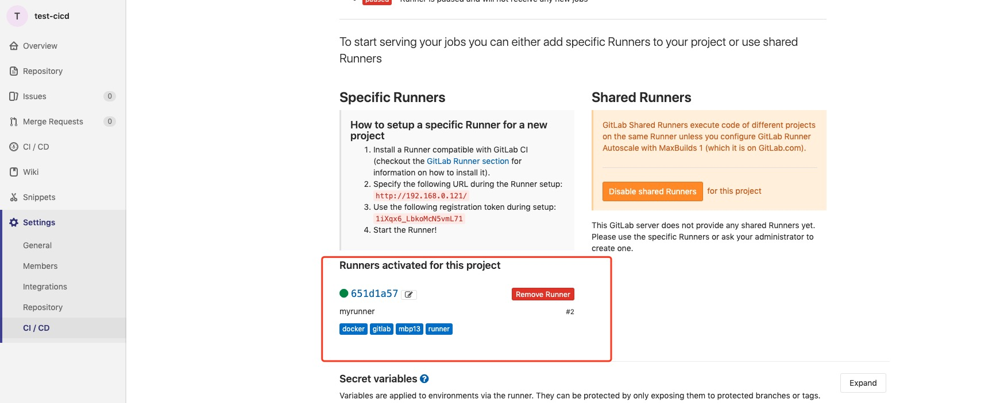

#gitlab CI/CD  
## gitlab CI/CD工作原理  
1.将代码托管到gitlab仓库     
2.在项目根目录下，创建.gitlab-ci.yml文件，在文件中指定build,test,deploy三个阶段的脚本  
3.当代push或merge时，gitlab检测到.gitlab-ci.yml文件，并使用gitlab runner工具来执行脚本    
4.脚本被分组为job，这些job共同组成pipeline    

[官方文档](https://docs.gitlab.com/ee/ci/introduction/)
##gitlab-cicd部署

本文主要的部署方式是使用docker run  

###1.gitlab部署  
gitlab版本 10.1.4-ce.0

***先决条件***  
安装docker  
  
gitlab部署可采用docker部署及启动。     
docker run -d --name gitlab --privileged=true \
--hostname 192.168.0.121 \
-p 1443:443 -p 80:1080 -p 1022:22 \
--restart=always \
-v /data/data/gitlab/config:/etc/gitlab \
-v /data/data/gitlab/logs:/var/log/gitlab \
-v /data/data/gitlab/data:/var/opt/gitlab \
docker.io/gitlab/gitlab-ce:10.1.4-ce.0
  
这里需要注意：    
   
- 端口映射问题    
	80，22，443 端口尽量不要使用默认的，可以做端口映射，防止与宿主机的端口冲突    
	
	将gitlab服务的80端口转换成其他端口并映射到宿主机   
	[参考资源](https://blog.csdn.net/hrbbeeant/article/details/104380009)

gitlab服务部署好后，在浏览器输入http://192.168.0.121，访问gitlab页面，最开始需要设置初始密码，默认用户名为root   
[参考资源1](https://www.cnblogs.com/sunsky303/p/10775126.html)     
[参考资源2](https://www.cnblogs.com/linuxk/p/10100431.html)

### 2.创建golang示例项目    
使用golang编写一个demo，并采用go mod构建，最后提交到gitlab下  
注意事项：  
-  容器22端口映射到宿主机的8022端口，当push代码到gitlab时会出现以下报错  
`ssh: connect to host 127.0.0.1 port 22: Connection refused
fatal: Could not read from remote repository.`    
解决方案是给远程分支设置ssh的端口号   
`git remote add origin ssh://git@192.168.0.121:8022/xxx/xx.git`   
[参考资源](https://www.cnblogs.com/forlive/p/13036328.html)      

### 3.部署gitlab-runner并注册
gitlab-runner 版本13.7.0   
这里使用的是docker 启动方式   
 
- 启动gitlab-runner  
`docker run -d --name gitlab-runner --restart always \
   -v /Users/banana/data/gitlab-runner/config:/etc/gitlab-runner \
   -v /var/run/docker.sock:/var/run/docker.sock \
   -v /usr/local/bin/docker:/bin/docker \
   gitlab/gitlab-runner:v10.1.0`  
   
容器内挂载了3个目录，分别是gitlab-runner的配置config、后面两个是为了能在docker容器中使用docker服务  

- runner注册    
	docker exec -it gitlab-runner gitlab-runner register  
	按照提示输入对应的内容，其中url和token是在gitlab服务上能找到    
	  
	
	注册完成后，可以在gitlab上看到配置的runner  
	      
	
	[runner注册参考资源](https://www.cnblogs.com/zzhaolei/p/11063345.html)
	
	***注册关键点***  
	- runner Executor执行器选择  
		- shell 
			job的执行环境是宿主机，以宿主机作为runner所有jobs的执行器。  
			runner会从远程仓库pull项目代码，工程的目录为：<working-directory>/builds/<short-token>/<concurrent-id>/<namespace>/<project-name>     
			比如 /home/gitlab-runner/builds/651d1a57/0/gitlab-cicd/test-cicd     
			如果你使用了cache，那么cache将会存在<working-directory>/cache/<namespace>/<project-name>，是否使用cache是在config.toml配置文件中指明。   
		- docker  
			所有jobs的执行环境是指定的docker image所生成的容器，每个job都会生成一个容器并且在job执行完成后销毁。      
			
			- build和cache的存储   
				Docker executor默认将所有的builds存储在容器中的/builds/<namespace>/<project-name>，可以通过修改config.toml配置文件的build_dir字段。   
				默认将所有的caches存储在container里的/cache目录，同样可以修改cache_dir字段  
			- Pull policies   
				当使用docker 或 docker+machine作为executors时，可以设置pull_policy来决定Runner如何pull docker image。pull_policy有三种值：
					always —— Runner始终从远程pull docker image。
					if-not-present —— Runner会首先检查本地是否有该image，如果有则用本地的，如果没有则从远程拉取。
					never —— Runner始终使用本地的image  
		

### 4.gitlab CI sonarqube搭建  
sonarqube版本8.6.0.39681
PostgreSQL版本 13.1

通过docker安装   
 
- 数据库postgres     

` docker pull postgres  
 docker run -d --name db \
	-p 5432:5432 \
	-e POSTGRES_USER=sonar \
	-e POSTGRES_PASSWORD=sonar \
	-v /home/banana/postgresql/postgresql:/var/lib/postgresql \
	-v /home/banana/postgresql/data:/var/lib/postgresql/data \
	postgres `   
	
- sonarqube     
`docker pull sonarqube
docker run -d --name sq \
	--link db -p 9000:9000 \
	-e SONARQUBE_JDBC_URL=jdbc:postgresql://db:5432/sonar \
	-e SONARQUBE_JDBC_USERNAME=sonar \
	-e SONARQUBE_JDBC_PASSWORD=sonar \
	-e vm.max_map_count=262144 \
	-v /home/banana/sonar/data:/opt/sonarqube/data \
	-v /home/banana/sonar/extensions:/opt/sonarqube/extensions \
	-v /home/banana/sonar/logs:/opt/sonarqube/logs \
	-v /home/banana/sonar/temp:/opt/sonarqube/temp \
	sonarqube`   
[参考资源](https://www.jianshu.com/p/8cdcb99abe72)

***部署sonar时出现一启动就退出，查看日志发现报错：max virtual memory areas vm.max_map_count [65530] is too low, increase to at least [262144]***       
 
[参考资源解决方案](https://blog.csdn.net/jiankunking/article/details/65448030)
 
部署好了可以通过http://47.92.195.72:9000 打开sonarqube页面

- sonarqube关联gitlab配置       
	- 安装sonar gitlab plugin    
		[下载插件](https://github.com/gabrie-allaigre/sonar-gitlab-plugin/releases)   
	- 重启sonar 
	- 配置gitlab通用账户   
		admin登录，在通用配置中设置gitlab url和gitlab user token  
		
[参考资源1](https://www.jianshu.com/p/8cdcb99abe72)
[参考资源2](https://www.cnblogs.com/wu-wu/p/13489207.html)  

	
- gitlab CI    
项目每次build都应该生成一个docker镜像，所以应针对gitlab示例项目编写Dockerfile。    
.gitlab-ci.yml文档编写。  

gitlab cicd是是由代码仓库下更目录下的.gitlab-ci.yml文件进行配置。这个文件可以指定cicd 流程中的构建、测试和部署的脚本。这些指定脚本是由gitlab runner来执行的。  
在.gitlab-ci.yml文件中，可以定义要运行的脚本，定义包含的依赖项，选择要按顺序运行的命令和要并行运行的命令，定义要在何处部署应用程序，以及指定是否要自动运行脚本或手动触发脚本。      
.gitlab-ci.yml文件中的任务是由Runners接管，并且由服务器中的runner执行，每一个任务的执行过程都是独立运行的。   
[.gitlab-ci.yml语法参考](https://github.com/yangshun2005/gitlab-cicd/blob/master/gitlab-ci%E8%AF%AD%E6%B3%95.md)    
[gitlab CI官方配置文件翻译](https://segmentfault.com/a/1190000010442764)    

[gitlab-ci.ymlsonar部分参考](https://www.jianshu.com/p/074c27708e9b)   

***遇到的问题：***  
- docker: command not found  
	解决方案：需给定docker镜像和docker依赖的服务，在要使用docker command的stage，增加`image: docker:18.09
  services:
    - docker:18.09-dind`  
    注意docker image和 services的版本，否则会出现第二个问题  
    
- Cannot connect to the Docker daemon at tcp://docker:2375/. Is the docker daemon running?    

	[参考文档1](https://www.cnblogs.com/sunsky303/p/10775126.html)   
	[参考文档2](https://gitlab.com/gitlab-org/gitlab-runner/-/issues/1986)      
	
- ERROR: Job failed (system failure): persistent connection closed  
	原因是宿主机的资源不足，CPU已经到达300%    
	[参考资源](https://gitlab.com/gitlab-org/gitlab-runner/-/issues/2347)
	
- 不同job之间的数据传输问题   
gitlab ci是将整个pipeline分成多个job来实现，不同job之间是独立的，要想实现不同job之间的数据传输，gitlab提供了两种方式     
	- 配置cache  
		全局cache，将job生成的产物存放在配置的cache目录下，提供给之后的job使用
	- 配置artifacts和dependency 
		artifacts 被用于在job作业成功后将制定列表里的文件或文件夹附加到job上，传递给下一个job ，如果要在两个job之间传递artifacts，必须设置dependencies  
		`build_image: 
			stage: build 
			script: 
			  -  xxx
			  -  xxx
			artifacts:
			  paths:
			    - aa
			    - bb/
		push_image:
			stage:push
			script:
			  - xxx
			dependencies:
			   - build_image`
[参考资源1](https://blog.csdn.net/textdemo123/article/details/94432961)
[参考资源2](https://www.jianshu.com/p/3c0cbb6c2936)  

- gitlab runner每次在执行pipeline的时候都会重新拉取镜像的解决方案  
	配置config.toml 
	[参考资源](https://blog.csdn.net/weixin_41915314/article/details/109587493)       
- docker login 出现Error response from daemon: Get https://registry.hisun.netwarps.com/v2/: unauthorized: authentication required     
 需要在项目和runner中配置镜像仓库的认证信息
	[参考资源](https://cloud.tencent.com/developer/article/1701933)
	

	
	
	

	

 

	  
	

  

