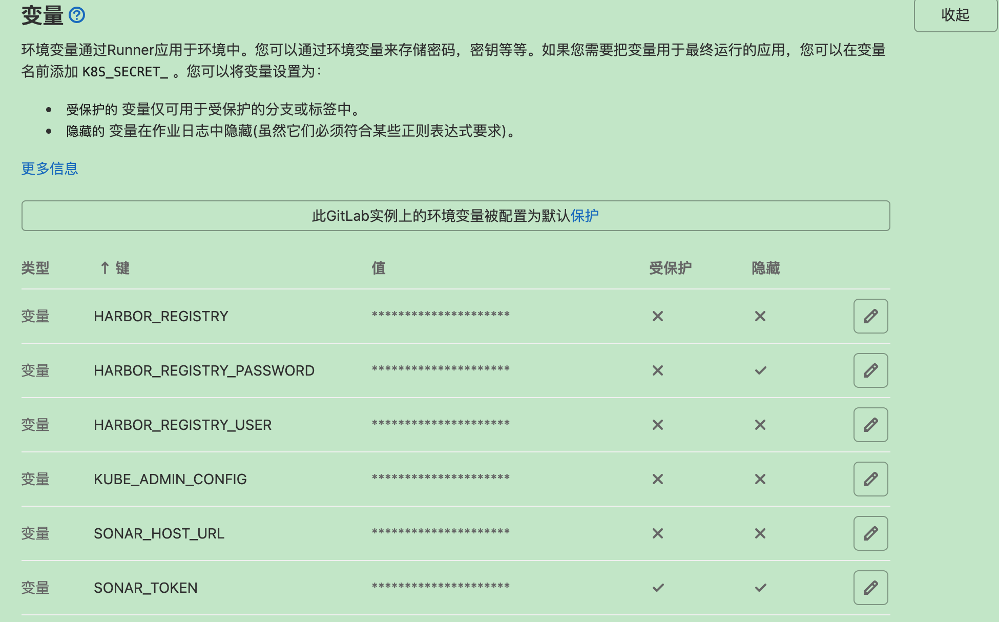
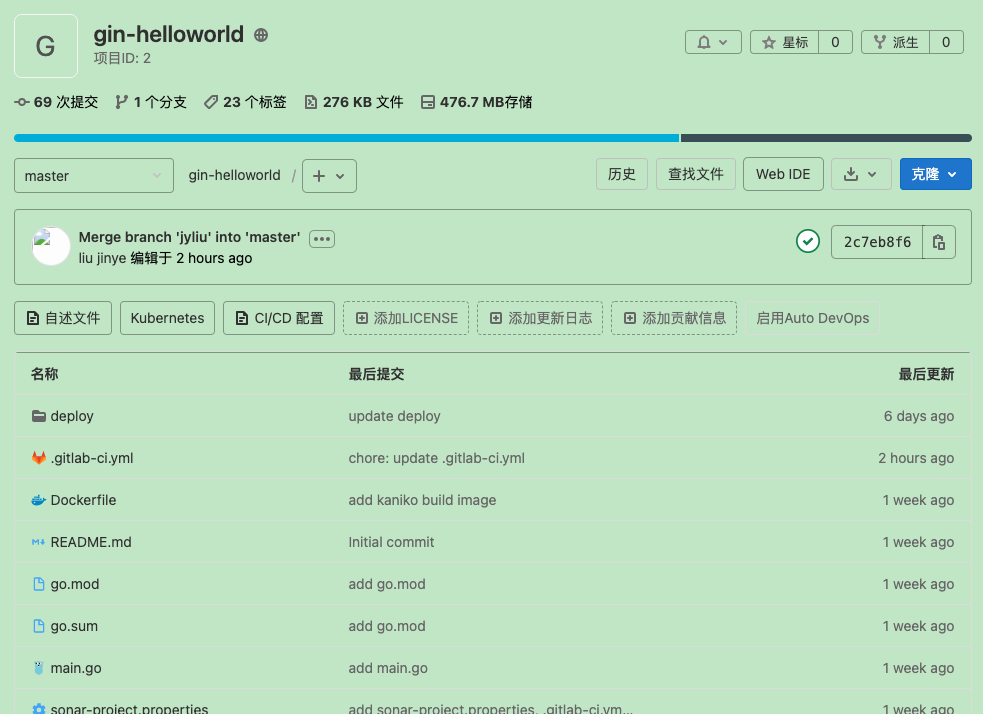

# k8s1.20使用helm部署gitlab


## 下载镜像到私有仓库

gitlab 相关

```
busybox:latest
busybox@sha256:c5439d7db88ab5423999530349d327b04279ad3161d7596d2126dfb5b02bfd1f
docker.io/bitnami/postgres-exporter:0.8.0-debian-10-r99
docker.io/bitnami/postgresql:11.9.0
docker.io/bitnami/redis:5.0.7-debian-9-r50
docker.io/bitnami/redis-exporter:1.3.5-debian-9-r23
docker.io/bitnami/kubectl:1.20
gitlab/gitlab-runner:alpine-v13.8.0
gitlab/gitlab-runner-helper:x86_64-775dd39d
jimmidyson/configmap-reload:v0.3.0
minio/mc:RELEASE.2018-07-13T00-53-22Z
minio/minio:RELEASE.2017-12-28T01-21-00Z
prom/prometheus:v2.15.2
quay.io/jetstack/cert-manager-cainjector:v0.10.1
quay.io/jetstack/cert-manager-controller:v0.10.1
registry.hisun.netwarps.com/gitlab-cng/alpine-certificates:20191127-r2=registry.gitlab.com/gitlab-org/build/cng/alpine-certificates:20191127-r2
registry.hisun.netwarps.com/gitlab-cng/gitaly:v13.8.4=registry.gitlab.com/gitlab-org/build/cng/gitaly:v13.8.4
registry.hisun.netwarps.com/gitlab-cng/gitlab-container-registry:v2.13.1-gitlab=registry.gitlab.com/gitlab-org/build/cng/gitlab-container-registry:v2.13.1-gitlab
registry.hisun.netwarps.com/gitlab-cng/gitlab-exporter:8.0.0=registry.gitlab.com/gitlab-org/build/cng/gitlab-exporter:8.0.0
registry.hisun.netwarps.com/gitlab-cng/gitlab-shell:v13.15.1=registry.gitlab.com/gitlab-org/build/cng/gitlab-shell:v13.15.1
registry.hisun.netwarps.com/gitlab-cng/gitlab-sidekiq-ee:v13.8.4=registry.gitlab.com/gitlab-org/build/cng/gitlab-sidekiq-ee:v13.8.4
registry.hisun.netwarps.com/gitlab-cng/gitlab-task-runner-ee:v13.8.4=registry.gitlab.com/gitlab-org/build/cng/gitlab-task-runner-ee:v13.8.4
registry.hisun.netwarps.com/gitlab-cng/gitlab-webservice-ee:v13.8.4=registry.gitlab.com/gitlab-org/build/cng/gitlab-webservice-ee:v13.8.4
registry.hisun.netwarps.com/gitlab-cng/gitlab-workhorse-ee:v13.8.4=registry.gitlab.com/gitlab-org/build/cng/gitlab-workhorse-ee:v13.8.4
registry.hisun.netwarps.com/gitlab-cng/kubectl:1.13.12=registry.gitlab.com/gitlab-org/build/cng/kubectl:1.13.12
registry.hisun.netwarps.com/gitlab-cng/cfssl-self-sign:1.2=registry.gitlab.com/gitlab-org/build/cng/cfssl-self-sign:1.2
```

kaniko 相关

```
alpine:3.12
gcr.io/kaniko-project/executor:v1.5.1-debug
gcr.io/go-containerregistry/crane:debug
```

## 添加 gitlab repo, 下载 chart 包

```
helm repo add gitlab https://charts.gitlab.io/
helm repo update
helm pull gitlab/gitlab
```

## 查看 values.yaml 及依赖的 requirements.yaml相关参数

[values.yaml](https://gitlab.com/gitlab-org/charts/gitlab/-/blob/master/values.yaml)

[requirements.yaml](https://gitlab.com/gitlab-org/charts/gitlab/-/blob/master/requirements.yaml)

## 创建 values.yaml

```
cat>values.yaml<<EOF
# --- Global settings ---

global:
  image:
    repository: registry.hisun.netwarps.com/gitlab-cng
  kubectl: 
    image: 
      repository: registry.hisun.netwarps.com/gitlab-cng/kubectl
      tag: 1.13.12
    init: 
      image:
        repository: registry.hisun.netwarps.com/gitlab-cng/cfssl-self-sign
        tag: 1.2
  certificates: 
    image: 
      repository: registry.hisun.netwarps.com/gitlab-cng/alpine-certificates
      tag: 20191127-r2


gitlab:
  #geo-logcursor: *custom
  gitaly:
    image:
      repository: registry.hisun.netwarps.com/gitlab-cng/gitaly
      tag: v13.8.4
    init: 
      image:
        repository: registry.hisun.netwarps.com/gitlab-cng/gitaly
        tag: v13.8.4
  gitlab-exporter:
    image:
      repository: registry.hisun.netwarps.com/gitlab-cng/gitlab-exporter
      tag: 8.0.0
    init: 
      image:
        repository: registry.hisun.netwarps.com/gitlab-cng/gitlab-exporter
        tag: 8.0.0
  # If global.grafana.enabled=true, uncomment below to set the custom image
  # gitlab-grafana: *custom
  gitlab-shell:
    image:
      repository: registry.hisun.netwarps.com/gitlab-cng/gitlab-shell
      tag: v13.15.1
    init: 
      image:
        repository: registry.hisun.netwarps.com/gitlab-cng/gitlab-shell
        tag: v13.15.1
  #mailroom: *custom
  migrations:
    image:
      repository:  registry.hisun.netwarps.com/gitlab-cng/gitlab-task-runner-ee
      tag: v13.8.4
    init: 
      image:
        repository: registry.hisun.netwarps.com/library/busybox
        tag: latest
  #operator: *custom
  sidekiq:
    image:
      repository: registry.hisun.netwarps.com/gitlab-cng/gitlab-sidekiq-ee
      tag: v13.8.4
    init: 
      image:
        repository: registry.hisun.netwarps.com/gitlab-cng/gitlab-sidekiq-ee
        tag: v13.8.4
  task-runner:
    image:
      repository: registry.hisun.netwarps.com/gitlab-cng/gitlab-task-runner-ee
      tag: v13.8.4
    init: 
      image:
        repository: registry.hisun.netwarps.com/gitlab-cng/gitlab-task-runner-ee
        tag: v13.8.4
  webservice:
    image:
      repository: registry.hisun.netwarps.com/gitlab-cng/gitlab-webservice-ee
      tag: v13.8.4
    init: 
      image:
        repository: registry.hisun.netwarps.com/gitlab-cng/gitlab-webservice-ee
        tag: v13.8.4
    workhorse:
      image: registry.hisun.netwarps.com/gitlab-cng/gitlab-workhorse-ee
      tag: v13.8.4

# --- Charts from requirements.yaml ---

certmanager:
  image:
    repository: registry.hisun.netwarps.com/jetstack/cert-manager-controller
    tag: v0.10.1
  cainjector:
    image:
      repository: registry.hisun.netwarps.com/jetstack/cert-manager-cainjector
      tag: v0.10.1

gitlab-runner:
  image: registry.hisun.netwarps.com/gitlab/gitlab-runner:alpine-v13.8.0
  runners:
    helpers:
      image: registry.hisun.netwarps.com/gitlab/gitlab-runner-helper:x86_64-775dd39d

minio:
  image: registry.hisun.netwarps.com/minio/minio
  imageTag: RELEASE.2017-12-28T01-21-00Z
  init:
    image: 
      repository: registry.hisun.netwarps.com/minio/minio
      tag: RELEASE.2017-12-28T01-21-00Z
  minioMc:
    image: registry.hisun.netwarps.com/minio/mc
    tag: RELEASE.2018-07-13T00-53-22Z


nginx-ingress:
  enabled: false

registry:
  image:
    repository: registry.hisun.netwarps.com/gitlab-cng/gitlab-container-registry
    tag: v2.13.1-gitlab
  init: 
    image:
      repository: registry.hisun.netwarps.com/gitlab-cng/gitlab-container-registry
      tag: v2.13.1-gitlab

postgresql:
  image:
    registry: registry.hisun.netwarps.com
    repository: bitnami/postgresql
    tag: 11.9.0
  metrics:
    image:
      registry: registry.hisun.netwarps.com
      repository: bitnami/postgres-exporter
      tag: 0.8.0-debian-10-r99

prometheus:
  install: false

redis:
  image:
    registry: registry.hisun.netwarps.com
    repository: bitnami/redis
    tag: 5.0.7-debian-9-r50
  metrics:
    image:
      registry: registry.hisun.netwarps.com
      repository: bitnami/redis-exporter
      tag: 1.3.5-debian-9-r23

upgradeCheck: 
  image:
    repository: registry.hisun.netwarps.com/library/busybox
    tag: latest


# If global.grafana.enabled=true, uncomment below to set the custom image
# grafana:
#   <<: *custom
#   sidecar:
#     image: custom-repository:custom-tag
EOF
```

## 执行安装

注意： 安装前需要检查 是否有默认 storageclass, 如果设计，按当前参数部署不支持，需要详细研究设置gitlab 关联的各服务 storageclass

```
helm upgrade --install gitlab gitlab-4.8.4.tgz \
  --namespace=gitlab --create-namespace \
  --timeout 600s \
  --set global.hosts.https=false \
  --set global.hosts.domain=apps164103.hisun.k8s \
  --set global.hosts.minio.minio=false \
  --set nginx-ingress.enabled=false \
  --set global.ingress.class=nginx \
  --set global.ingress.tls.enabled=false \
  --set certmanager.install=false \
  --set global.ingress.configureCertmanager=false \
  --set global.minio.ingress.tls.enabled=false \
  --set gitlab-runner.runners.cache.s3CacheInsecure=true \
  -f values.yaml
```

## 查看 pod 状态

```
kubectl get pod -n gitlab
```

## 查看更新历史

```
helm history gitlab -n gitlab
```

## 回滚上一个版本

```
helm rollback gitlab -n gitlab
```

## 对接 prometheus

### 创建 ServiceMonitor 或 PodMonitor

下载 [gitlab-monitor.yaml](./yamls/gitlab-monitor.yaml)

执行创建或更新 `gitlab-monitor.yaml`

```
kubectl apply -f gitlab-monitor.yaml -n gitlab
```

### 创建 gitlab PrometheusRule

下载 [gitlab-prometheus-rules.yaml](./yamls/gitlab-prometheus-rules.yaml)

```
kubectl apply -f gitlab-prometheus-rules.yaml -n gitlab
```

注意：如果创建了 rule 相关配置，没有被prometheus 发现的

查看已经部署的 prometheus 相关配置

```
kubectl get prometheus prometheus-community-kube-prometheus -o yaml -n monitoring
```

看到下面相关 Selector 内容

```
  ...
  podMonitorSelector:
    matchLabels:
      release: prometheus-community
  ...
  ruleSelector:
    matchLabels:
      app: kube-prometheus-stack
      release: prometheus-community    
  ...
  serviceMonitorSelector:
    matchLabels:
      release: prometheus-community
```

按已有 `prometheus`中 `ruleSelector` 配置 修改 `gitlab-prometheus-rules.yaml`  中 ,再重新执行创建或更新 `gitlab-prometheus-rules.yaml`

```
kind: PrometheusRule
metadata:
  labels:
	 ...
    app: kube-prometheus-stack
    release: prometheus-community
  name: gitlab-rules
```

### 导入 grafana dashboards

#### 添加数据源

使用管理员打开 grafana

左边菜单 `Configuration` --> `Data Sources` --> `Add data source`

选择 `Time series databases` 为 `Prometheus`

`Name` 填写 `GitLab Omnibus`

`URL` 填写 `http://prometheus-community-kube-prometheus:9090/` # 同默认的 prometheus URL

点击最下方 `Save & Test`


#### 导入 dashboards

导入 [grafana-dashboards](./grafana-dashboards) 目录下所有 dashboards

## 访问 web

查看默认账号root密码

```
kubectl get secret gitlab-gitlab-initial-root-password -ojsonpath='{.data.password}'  -n gitlab | base64 --decode ; echo
```

访问

```
http://gitlab.apps164103.hisun.k8s/
```

## 设置默认语言

右上角用户头像 --> setting --> Preferences --> Localization ——> 简体中文


## 设置全局 kubenetes

参考： 

[连接现有 k8s 集群](https://docs.gitlab.com/ee/user/project/clusters/add_remove_clusters.html#existing-kubernetes-cluster)

点左上角管理中心 --> Kubernetes --> 与集群证书集成——> 连接现有集群-->

输入Kubernetes集群的详细信息

### 1、Kubernetes 集群名称(必须)
	hisun-k8s
### 2、环境范围(必须)
	*
### 3、API地址

在 k8s master 查看 api 地址

```
kubectl cluster-info | grep -E 'Kubernetes master|Kubernetes control plane' | awk '/http/ {print $NF}'

https://172.26.164.103:6443
```
输入显示 的结果 `https://172.26.164.103:6443`

### 4、CA证书

在 k8s master 查看 default-token-xxxxx 的 secret token

```
kubectl get secrets -n gitlab |grep default-token

default-token-8hwrs                   kubernetes.io/service-account-token   3      8d
```

```
kubectl get secret -n gitlab default-token-8hwrs -o jsonpath="{['data']['ca\.crt']}" | base64 --decode
```

输出的结果 copy 到输入框

### 5、服务令牌(Token) - GitLab使用服务Token对Kubernetes进行身份验证,作用域为特定名称空间。所使用的令牌应该属于一个 service account:
cluster-admin 权限。创建此 service account:

- (1) 创建 `gitlab-admin-service-account.yaml`

```
cat > gitlab-admin-service-account.yaml <<EOF
apiVersion: v1
kind: ServiceAccount
metadata:
  name: gitlab
  namespace: gitlab
---
apiVersion: rbac.authorization.k8s.io/v1
kind: ClusterRoleBinding
metadata:
  name: gitlab-admin
roleRef:
  apiGroup: rbac.authorization.k8s.io
  kind: ClusterRole
  name: cluster-admin
subjects:
  - kind: ServiceAccount
    name: gitlab
    namespace: gitlab
EOF
```

- (2) 执行创建 service account 并绑定 cluster-admin 权限

```
kubectl apply -f gitlab-admin-service-account.yaml
```

- (3) 查看 gitlab token

```
kubectl -n gitlab describe secret $(kubectl -n gitlab get secret | grep gitlab-token | awk '{print $1}')
```

复制输出结果 中的 token 到 服务令牌输入框

- (4) 点击添加 Kubernetes 集群

如果API 提示报错 `is blocked: Requests to the local network are not allowed`

参考：下方故障处理中 `连接 Kubenetes 集群时报不能访问 local network` 的报错解决

成功后跳转到另一个页面，显示 实例集群 kont-prod-k8s 信息

## 安装 sonarqube

参考：[helm线下安装SonarQube.md](./helm线下安装SonarQube.md)

## 添加CI/CD全局环境变量

### sonarqube

[https://docs.sonarqube.org/latest/analysis/gitlab-integration/](https://docs.sonarqube.org/latest/analysis/gitlab-integration/)

[https://docs.sonarqube.org/8.5/analysis/gitlab-cicd/](https://docs.sonarqube.org/8.5/analysis/gitlab-cicd/)

#### 获取 sonar token

访问 `http://sonar.apps164103.hisun.k8s/`

在 sonarqube 生成 token

右上角头像--> My Account-->Security--> Tokens--> Generate Tokens

输入 token 名称，点 `Generate`

copy token 

#### 添加 sonarqube 全局变量

在 gitlab 打开 管理中心--> 设置--> CI/CD-->变量-->展开

添加 sonar 相关变量

```
SONAR_HOST_URL  http://sonarqube-sonarqube.sonarqube.svc:8181
SONAR_TOKEN  sonar生成的token
```

SONAR_TOKEN 勾选 保护变量 和 隐藏变量

SONAR_HOST_URL 不勾选 保护变量 和 隐藏变量

注意： 其中 SONAR_HOST_URL 设置的是sonarqube 的内部 svc 域名,如果访问集群外 sonar 按真实地址修改


### harbor

管理中心--> 设置--> CI/CD-->变量-->展开

添加 harbor 相关变量

```
HARBOR_REGISTRY
HARBOR_REGISTRY_PASSWORD
HARBOR_REGISTRY_USER
```

注意：HARBOR_REGISTRY_PASSWORD不能设置受保护，可以设置隐藏(在作业日志中不显示密码)，不然 gitlab-ci 获取不到 HARBOR_REGISTRY_PASSWORD 值(目前不明原因)

### k8s admin

在 master 执行

```
cat ~/.kube/config |base64
```

复制结果内容

管理中心--> 设置--> CI/CD-->变量-->展开

添加全局变量到 gitlab CI/CD

```
KUBE_ADMIN_CONFIG
```

### 全局变量列表



## 代码集成 giltab ci

### k8s 环境创建需要使用的 namespace

```
kubectl create namespace helloworld
```

### 准备 golang gin demo 代码


在 gitalb 创建 `gin-helloworld` 项目

下载下面代码示例, 解压后目录中的内容提交到项目中

```
https://pnode.solarfs.io/dn/file/d0ebe4f04fdae7557121b5fde488d2ab/gin-helloworld-master.tar.gz
```



示例代码中主要包含
	- `deploy` 是k8s 部署相关yaml,触情修改
	- golang gin 编写的 helloworld web 服务
	- Dockerfile
	- sonar-pproject.properties sonar检查使用配置
	- .gitlab-ci.yaml

### ci/cd 配置 .gitlab-ci.yaml

步骤说明

- test # go fmt 检测、sonar 检测
- build # 编译二进制
- buildImage # 构建镜像，tag 为 commitid
- deploy-commit # 部署 commitid 镜像到开发环境
- crane-image-tag # commitid 镜像，增加 tag 版本镜像，增加 latest 版本镜像  
- deploy # 部署 tag 版本镜像到开发环境

修改下面示例中 `REPO_NAME` 为实际项目地址，下面示例中`gitlab-webservice-default.gitlab.svc:8181` 为 k8s 集群内部 svc 域名地址，如果访问外部  giltab 或 github 地址，按真实地址修改

```
# gitlab-ci 使用的基础镜像
image: registry.hisun.netwarps.com/library/golang:1.15.8

variables:
  # Gitlab Project Repo
  REPO_NAME: gitlab-webservice-default.gitlab.svc:8181/liujinye/gin-helloworld
  # goproxy
  GOPROXY: https://goproxy.cn
  GIT_DEPTH: "3"  # 代码 git fetch 或 clone 的深度，如果 设置1，有作业队列或重试作业的时候可能会导致作业失败

# 当前项目加入 GOPATH，跳转到当前项目目录
before_script:
  - mkdir -p $GOPATH/src/$(dirname $REPO_NAME)
  - ln -svf $CI_PROJECT_DIR $GOPATH/src/$REPO_NAME
  - cd $GOPATH/src/$REPO_NAME

# sonarqube 检测
sonarqube-check:
  image:
    name: registry.hisun.netwarps.com/sonarsource/sonar-scanner-cli:4
    entrypoint: [""]
  variables:
    SONAR_USER_HOME: "${CI_PROJECT_DIR}/.sonar"  # Defines the location of the analysis task cache
  cache:
    key: "${CI_JOB_NAME}"
    paths:
      - .sonar/cache
  script:
    - sonar-scanner -Dsonar.qualitygate.wait=true
  only:
    - merge_requests
    - master
    - develop

stages:
  - test
  - sonarqube-check
  - build
  - buildImage
  - deploy-commit
  - crane-image-tag
  - deploy

.go-cache:
  variables:
    GOPATH: $CI_PROJECT_DIR/.go
  before_script:
    - mkdir -p .go
  cache:
    paths:
      - .go/pkg/mod/
      
format:
  stage: test
  extends: .go-cache
  script:
    - go fmt $(go list ./... | grep -v /vendor/)
    - go vet $(go list ./... | grep -v /vendor/)
    - go test -race $(go list ./... | grep -v /vendor/)
  only:
    - merge_requests
    - master

compile:
  stage: build
  extends: .go-cache
  script:
    - CGO_ENABLED=0 GOOS=linux GARCH=amd64 go build -a -installsuffix cgo -ldflags "-extldflags '-static'" -o $CI_PROJECT_DIR/helloworld
  artifacts:
    paths:
      - helloworld
  only:
    - merge_requests
    - master
      
build:
  stage: buildImage
  image:
    name: registry.hisun.netwarps.com/kaniko-project/executor:v1.5.1-debug
    entrypoint: [""]
  script:
    - mkdir -p /kaniko/.docker
    - echo "{\"auths\":{\"$HARBOR_REGISTRY\":{\"username\":\"$HARBOR_REGISTRY_USER\",\"password\":\"$HARBOR_REGISTRY_PASSWORD\"}}}" > /kaniko/.docker/config.json
    - /kaniko/executor --cache=true --cache-ttl=12h --context $CI_PROJECT_DIR  --dockerfile $CI_PROJECT_DIR/Dockerfile --destination $HARBOR_REGISTRY/helloworld/helloworld:$CI_COMMIT_SHORT_SHA
  only:
    - master
  artifacts:
    paths:
      - helloworld
      
deploy_dev:
  stage: deploy-commit
  image:
    name: registry.hisun.netwarps.com/bitnami/kubectl:1.20
    entrypoint: [""]
  before_script:
    - echo "${KUBE_ADMIN_CONFIG}" |base64 -d > /tmp/kubeconfig
  script:
    - sed -i "s/newTag:.*/newTag:\ $CI_COMMIT_SHORT_SHA/g" $CI_PROJECT_DIR/deploy/dev/kustomization.yaml
    - kubectl --kubeconfig=/tmp/kubeconfig apply -k $CI_PROJECT_DIR/deploy/dev/
  only:
    - master

crane_tag:
  stage: crane-image-tag
  image:
    name: registry.hisun.netwarps.com/go-containerregistry/crane:debug
    entrypoint: [""]
  script:
    - /ko-app/crane auth login -u $HARBOR_REGISTRY_USER -p $HARBOR_REGISTRY_PASSWORD $HARBOR_REGISTRY 
    - /ko-app/crane tag $HARBOR_REGISTRY/helloworld/helloworld:$CI_COMMIT_SHORT_SHA latest 
    - /ko-app/crane tag $HARBOR_REGISTRY/helloworld/helloworld:$CI_COMMIT_SHORT_SHA $CI_COMMIT_TAG
  rules:
    - if: $CI_COMMIT_TAG
    
deploy_dev_tag:
  stage: deploy
  image:
    name: registry.hisun.netwarps.com/bitnami/kubectl:1.20
    entrypoint: [""]
  before_script:
    - echo "${KUBE_ADMIN_CONFIG}" |base64 -d > /tmp/kubeconfig
  script:
    - sed -i "s/newTag:.*/newTag:\ $CI_COMMIT_TAG/g" $CI_PROJECT_DIR/deploy/dev/kustomization.yaml
    - kubectl --kubeconfig=/tmp/kubeconfig apply -k $CI_PROJECT_DIR/deploy/dev/
  rules:
    - if: $CI_COMMIT_TAG
```

### 项目连接现有 kubernetes 

#### 配置项目连接 Kubernates

管理中心 --> Kubernetes --> kont-prod-k8s --> 高级设置

集群管理项目 选择 `xxxxxx / Gin Helloworld`

点击保存修改


#### 在 k8s 集群中创建一个 `helloworld` 的 namespace

```
kubectl create ns helloworld
```

命名空间框输入
    
```
helloworld 
```

注：设置名称空间的前缀。如未设置，则默认为项目路径。如进行了修改，则现有环境仍将使用其当前的名称空间，直到清除群集缓存。


### 触发CI/CD流程

#### 提交pr

触发 .gitlab-ci.yaml 中 test、build 步骤

#### 合并 pr

触发 .gitlab-ci.yaml 中 test、build、buildImage、deploy-commit

#### 打 tag

触发 crane-image-tag、deoloy

## 故障处理

### gitlab-runner 访问 gilab 服务 解析不到域名

#### 相关报错

```
gitlab runner  no such host
```

#### 解决方法

注意：如果ingress 前面使用了 阿里云的 SLB 负载均衡，集群内 ingress 主机是不能访问 LB 的，所以访问内部服务必须使用 svc 域名地址，不能使用 ingress host 地址

自建 dnsmasq server 添加泛解析

```
address=/apps164103.hisun.k8s/172.26.164.104
```

修改所有主机 /etc/resolv.conf 使用统一 自定义 dns server 

```
options timeout:2 attempts:3 rotate single-request-reopen
; generated by /usr/sbin/dhclient-script
nameserver 172.26.164.91
```

### gitlab-runner 访问 gitlab 报证书验证错误

#### 报错信息

```
x509: certificate is valid for ingress.local and not valid for other server defined using regex
```

#### 临时解决方法

禁用 tls 及 certmanager 管理证书

helm 安装是设置下面参数

```
  --set global.hosts.https=false \
  --set certmanager.install=false \
  --set global.ingress.configureCertmanager=false \
```

### 连接 Kubenetes 集群时报不能访问 local network

```
is blocked: Requests to the local network are not allowed
```

打开管理中心-->设置-->网络-->外发请求

勾选 `允许Webhook和服务对本地网络的请求`


```
http://gitlab.apps164103.hisun.k8s/admin/application_settings/network
``` 

参考：

[官方helm部署指南](https://docs.gitlab.com/charts/installation/deployment.html)

[Gitlab Configure Charts using Globals](https://docs.gitlab.com/charts/charts/globals.html)

[GitLab cloud native Helm Chart](https://docs.gitlab.com/charts/)

[external-cert-manager-and-issuer-external](https://gitlab.com/gitlab-org/charts/gitlab/blob/master/doc/installation/tls.md#external-cert-manager-and-issuer-external)

[https://docs.gitlab.com/charts/advanced/external-nginx/index.html](https://docs.gitlab.com/charts/advanced/external-nginx/index.html)

[custom-images values.yaml](https://gitlab.com/gitlab-org/charts/gitlab/-/blob/master/examples/custom-images/values.yaml)

[https://docs.gitlab.com/ee/ci/yaml/README.html](https://docs.gitlab.com/ee/ci/yaml/README.html)

[大 gitlab-ci.yml 示例](https://gitlab.com/gitlab-org/gitlab/-/blob/master/.gitlab-ci.yml)

[https://docs.gitlab.com/charts/charts/gitlab/gitlab-runner/index.html](https://docs.gitlab.com/charts/charts/gitlab/gitlab-runner/index.html)

[https://docs.gitlab.com/ee/ci/docker/using_kaniko.html](https://docs.gitlab.com/ee/ci/docker/using_kaniko.html)

[https://docs.gitlab.com/ee/ci/yaml/README.html#rules](https://docs.gitlab.com/ee/ci/yaml/README.html#rules)

[https://docs.gitlab.com/charts/charts/registry/index.html](https://docs.gitlab.com/charts/charts/registry/index.html)

[https://gitlab.com/gitlab-org/grafana-dashboards/tree/master/omnibus](https://gitlab.com/gitlab-org/grafana-dashboards/tree/master/omnibus)