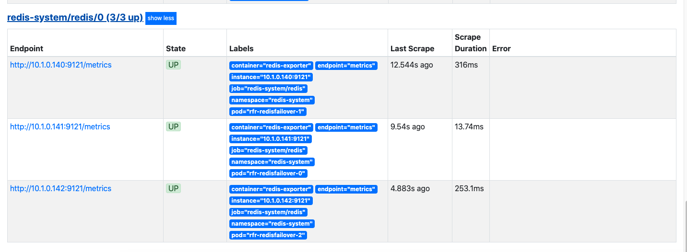
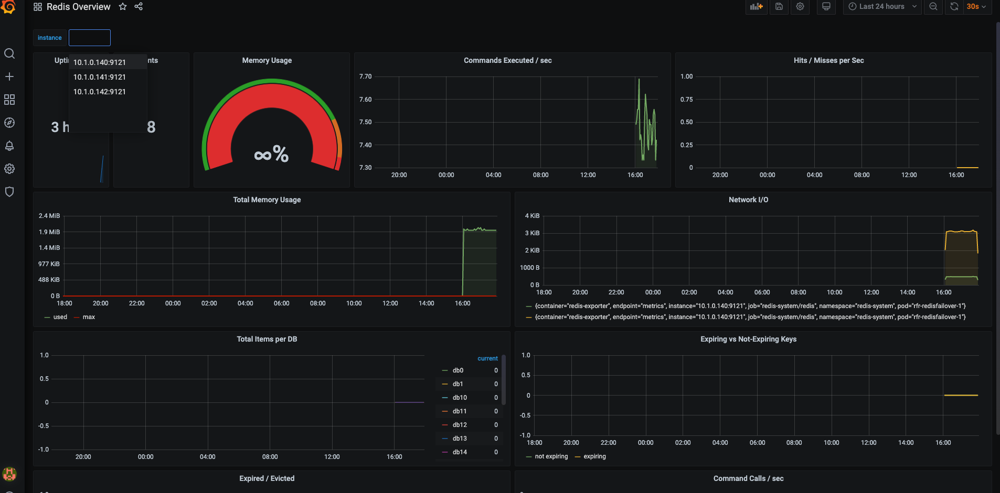

### Redis-Operator部署


#### 集群模式为哨兵模式

- 默认部署为1个master、2个slave、3个sentinel
- 数据默认发布不提供pvc支持，需要手动配置
#### 功能支持

- yaml、helm部署operator
- 升级更新(文档中未找到)
- 故障转移（哨兵的功能）
    - 数据备份（redis的功能）
    - 数据还原（redis的功能）
- 支持redis、sentinel扩缩
- 支持监控，提供metric界面

#### Yaml部署方式

- [下载源码](./https://github.com/spotahome/redis-operator)
- 创建namespace
    ```
    kubectl create namespace redis-system 
    ```
- 发布all-redis-operator-resources.yaml（这是创建operator）
    ```
    kubectl apply -f ./example/redisfailover/all-redis-operator-resources.yaml -n redis-system 
    ```
- 发布basic.yaml，这是redis集群基础模板
- 支持监控，使用./example/redisfailover/enable-exporter.yaml两个选一个发布，否则冲突(我使用的是支持监控的发布方式)
    ```
    #常规发布
    kubectl apply -f ./example/redisfailover/basic.yaml -n redis-system 
    #支持监控
    kubectl apply -f ./example/redisfailover/enable-exporter.yaml -n redis-system 
    ``` 
- 使用pod-monitor.yaml创建监控对象。

    ```
    apiVersion: monitoring.coreos.com/v1
    kind: PodMonitor
    metadata:
      name: redis
      labels:
        release: prometheus-community
    spec:
      podMetricsEndpoints:
        - interval: 15s
          port: metrics
      selector:
        matchLabels:
          app.kubernetes.io/component: redis
      namespaceSelector:
        any: true
    ```
- 依赖镜像

    ```
    #常规发布
    redis:5.0-alpine
    quay.io/spotahome/redis-operator:latest
    
    #支持监控的发布
    leominov/redis_sentinel_exporter:1.3.0
    oliver006/redis_exporter:v1.3.5-alpine
    ```
    
#### 验证服务

 - 查看CRD

     ```
    likai@likaideMacBook-Pro:~$  kubectl get all -l app.kubernetes.io/name=redisfailover -n redis-system
    NAME                                    READY   STATUS    RESTARTS   AGE
    pod/rfr-redisfailover-0                 2/2     Running   0          115m
    pod/rfr-redisfailover-1                 2/2     Running   0          115m
    pod/rfr-redisfailover-2                 2/2     Running   0          115m
    pod/rfs-redisfailover-784c7dc77-2zrj2   2/2     Running   0          115m
    pod/rfs-redisfailover-784c7dc77-5xzkp   2/2     Running   0          115m
    pod/rfs-redisfailover-784c7dc77-j6vgd   2/2     Running   0          115m

    NAME                        TYPE        CLUSTER-IP       EXTERNAL-IP   PORT(S)     AGE
    service/rfr-redisfailover   ClusterIP   None             <none>        9121/TCP    115m
    service/rfs-redisfailover   ClusterIP   10.110.161.243   <none>        26379/TCP   115m

    NAME                                READY   UP-TO-DATE   AVAILABLE   AGE
    deployment.apps/rfs-redisfailover   3/3     3            3           115m

    NAME                                          DESIRED   CURRENT   READY   AGE
    replicaset.apps/rfs-redisfailover-784c7dc77   3         3         3       115m

    NAME                                 READY   AGE
    statefulset.apps/rfr-redisfailover   3/3     115m
     ```
    
    - 可以看出来sentinel(哨兵)通过deployment发布的，有3个实例是个无状态服务。
    - redis是通过statefulset发布的，有3个实例。
    - 因为需要监控redis的数据所以，创建了redis metrics的service，使prometheus可以收集到。
    - 默认会创建哨兵的service。
    - 服务的命名rfs-开头的为哨兵服务
    - 服务的命名rfr-开头的为redis服务
    
- 查看operator

    ```
    likai@likaideMacBook-Pro:~$ kubectl get deployment -n redis-system
    NAME                READY   UP-TO-DATE   AVAILABLE   AGE
    redisoperator       1/1     1            1           154m
    rfs-redisfailover   3/3     3            3           152m
    ```
 - redis-operator是通过deployment部署的，有一个实例。

- 查看metric
    ```
    kubectl port-forward svc/prometheus-operated 9121:9121 -n redis-system        
    ```
    - 访问：https://127.0.0.1:9121/metrics
- 查看prometheus target

   ```
    kubectl port-forward svc/prometheus-operated 9090:9090 -n monitoring 
    ```
    - 访问：https://127.0.0.1:9090
    
   		

#### Redis Grafana模板

- 下载[Redis Grafana模板](https://grafana.com/grafana/dashboards/763)
- 访问Grafana 
    - http://127.0.0.1:3000
    ```
    kubectl port-forward svc/prometheus-community-grafana 3000:80 -n monitoring
    ```
- 导入模板保存
	
	
	
#### 下一步
  
 - 结合redis哨兵模式，验证服务可用性。
 - helm一键部署服务
 
#### END